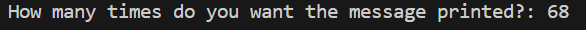
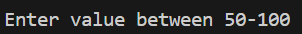
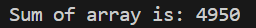
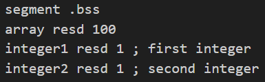
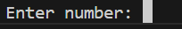
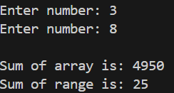
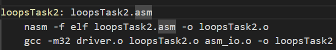
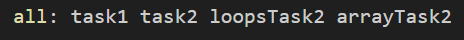

Task1
- creating task2.asm
started by creating the file task2.asm, copy and pasted the code in (had to change quoatation marks as they were curly from the Powerpoint, changed this to straight, ")
copied "nasm -f elf task1.asm -o task1.o" changed to "nasm -f elf task2.asm -o task2.o" ran in terminal
did not work, heres my errors   task2.asm:1: error: `%include' expects a file name
                                task2.asm:3: error: expression syntax error
                                task2.asm:4: error: expression syntax error
                                task2.asm:5: error: expression syntax error
                                task2.asm:6: error: expression syntax error
fixed error 1 by changing the quoatation marks as I forgot
fixed other errors by changing quoatation marks to straight
copied "gcc -m32 driver.o task1.o asm_io.o -o task1" changed to "gcc -m32 driver.o task2.o asm_io.o -o task2"
ran "./task2" in terminal
    outputted:
        Enter a number: 3     
        Enter a number: 5
        The sum of 3 and 5 is: 8
    where "Enter a number:" is an input

Task2
- creating loopsTask2
started by creating the messages for entering name and entering printTimes
    msg1 db "Enter your name: ", 0 ;input name
    msg2 db "How many times do you want the message printed?: ", 0 ;input times
declared the values space in bss
    segment .bss
    ;name resd 1 ;name
    printTimes resd 2 ;integer
started on the main to print message for name input, then store
                       print message for printTimes input, then store
    later on while creating the loop, there is no read_string function in asm_io, i dont know if i was supposed to add this so i have just commented (;) out my code so it won't create an error
        (my understanding was it would print Welcome! [name])
created the first loop to make sure that printTimes was less than 100, I defined 100 and 50 at the start of the program, along with num3 to compare it with later on
    num1 dd 100
    num2 dd 50
    num3 dd 0

    ;in the loop
    mov eax, [printTimes] ;get times value
    cmp eax, [num1]  ; compare w num1
    jl lessThan100 ;if less than
    jmp end_if ;if greater than
if it was less than 100 then it sent the program here, where i compared with num2 (50), if it was greater than 50 it sent you to the next bit of the program, if not sent to end of if
    lessThan100:
    cmp eax, [num2] ;compare w num2 ;compate w num2
    jg greaterThan50 ;if greater send there

    jmp end_if ;if less than send there
created loop to check if num3 (0) which is used for the count, is equal to printTimes, if it is sends program to the end of loop, if it is not equal it prints the welcome message and adds one to num3 each time.
    loop_start:
            mov eax, [num3]
            cmp eax, [printTimes]
            je loop_end

            mov eax, msg3 ; welcome message (defined at start of program)
            call print_string ;print
            call print_nl ;new line

            (lines calling in num3 are in the file)
            add eax, 1        ; add 1 to count
i then end the loop and if and added a error message to let the user know if the value is not in range
    end_error:
    mov eax, msg4   
    call print_string
    call print_nl

-creating arrayTask2
started by creating the messages and variables i would need, like arrayTotal and message to print the sum
i set up the segment .bss to have space for all 100 integers in array
    segment .bss
    array resd 100
i copy and pasted the loop i had from loopsTask2, kept the code i needed which was, comparing two numbers, adding to the counter
then created code to add numbers to the array, and to add numbers to the sum
        mov [array + eax*4], eax ; add num to array

        mov ebx, [arrayTotal]
        add ebx, [array + eax*4] ;add current array num to arrayTotal
        mov [arrayTotal], ebx
the first line adds a number to the array, had to use eax*4 as the bss is 4 bytes so i had 400 bytes this filled my array with cronological numbers till 100
the next lines added the number to the array total 
as 1 was added to the counter this new number was added to the array and to the array total
then printed out the message with the array total

then i worked on doing the same for a range
i copy and pasted the code used for the array, however i added integer1 and integer2 at the start
    
    mov eax, msg2 ; 
    call print_string
    call read_int ; read the first integer
    mov [integer1], eax ; store it in memory
    mov eax, msg2 ; 
    call print_string
    call read_int ; read the second integer
    mov [integer2], eax ; store it in memory
    call print_nl
printed a message guiding the user to enter a number, did this twice and read in the two integers
i used these integers in a loop so when they were equal the loop would end, to sum the range i used the same way for the array, but added eax which was integer1 to the total, then added 1, and repeated this until integer1 was equal to integer2, saved that value in rangeTotal
    mov ebx, [rangeTotal]
    add ebx, eax ;add current range num to rangeTotal
    mov [rangeTotal], ebx
and added in a message to print the total

Task 3
i created the makefile easily by copy and pasting what i had recently been entering into my terminal to run loopsTask2, i completed it after this task and i accidentally read ahead

then i copy and pasted this and changed the file names for each of them
then added them to all

this set up my files properly as it creates the .o file and linked them together to create an executable

