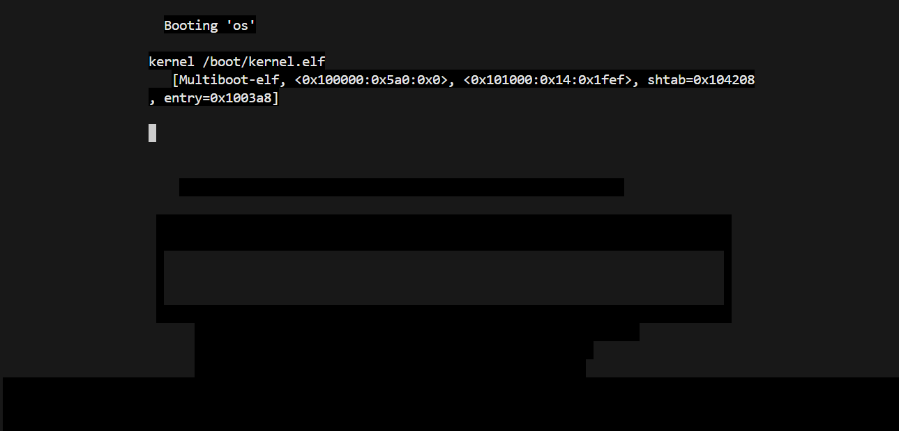

- task 1
for task 1 i created the file structure from the brief
copy and pasted the code into loader.asm
then exectued using the line below
    nasm -f elf loader.asm
added the linker script to link.ld in file, source, then executed with the line below
    ld -T ./source/link.ld -melf_i386 loader.o -o kernel.elf
needed to copy stage2_eltorito to grub directory so i used
    cd /opt/os/stage2_eltorito iso/boot/grub
created the configuration file for GRUB, copy and pasted the code to menu.lst
 the file directory structure
then used the command to create iso image
    genisoimage -R \
        -b boot/grub/stage2_eltorito \
        -no-emul-boot \
        -boot-load-size 4 \
        -A os \
        -input-charset utf8 \
        -quiet \
        -boot-info-table \
        -o os.iso \
        iso
used the command below to boot
    qemu-system-i386 -nographic -boot d -cdrom os.iso -m 32 -d cpu -
    D logQ.txt
found EAX=CAFEBABE in logQ.txt to make sure it booted correctly

then created the Makefile to build the kernel and run the program, by adding the commands used in the terminal to compile, i added -o loader.o to make a .o file for it, added the command to boot into run:
    buildKernel:
        nasm -f elf loader.asm -o loader.o
        ld -T ./source/link.ld -melf_i386 loader.o -o kernel.elf
        cp /opt/os/stage2_eltorito iso/boot/grub
        genisoimage -R \
            -b boot/grub/stage2_eltorito \
            -no-emul-boot \
            -boot-load-size 4 \
            -A os \
            -input-charset utf8 \
            -quiet \
            -boot-info-table \
            -o os.iso \
            iso
    run:
        qemu-system-i386 -nographic -boot d -cdrom os.iso -m 32 -d cpu -D logQ.txt
when this was ran, i could not use ctrl^c to quit, i had to use this
to exit iso
    ps aux | grep qemu
which would print a long message and after it had a variation of my name it has a number i would use after kill to shut it down
    kill (digits after user)

- task 2
used the code from chapter 3, added the C code into a C file called cfunctions.c 
    int sum_of_three(int arg1, int arg2, int arg3)
    {
    return arg1 + arg2 + arg3;
    }
added the assembler code to loader.asm
    loader: ; the loader label (defined as entry ↪ point in linker script) 
        mov eax, 0xCAFEBABE 
        
        extern sum_of_three ; the function sum_of_three is defined elsewhere

        push dword 3 ; arg3
        push dword 2 ; arg2
        push dword 1 ; arg1
        call sum_of_three ; call the function, the result will be in eax
        mov ebx, eax
then created the two other functions for this task, one to multiply two numbers, another to subract three numbers
    int multiply_two(int arg4, int arg5)
    {
        return arg4 * arg5;
    }

    int subtract_three(int arg6, int arg7, int arg8)
    {
        return arg6 - arg7 - arg8;
    }
added assembly code to loader.asm, what it does is push the integers to be used in the calculations, call the functions externally (had to use extern not external as thats what i saw said), then the returned value would be in eax, but the be moved into ecx, or edx so they did not overlap and could be displayed
    extern multiply_two
    extern subtract_three

    push dword 4 ; arg4
    push dword 5 ; arg5
    call multiply_two
    mov ecx, eax

    push dword 8 ; arg6
    push dword 7 ; arg7
    push dword 6 ; arg8
    call subtract_three
    mov edx, eax
then i added cfunctions.c into my Makefile inside buildKernel
    	gcc -m32 -c -O0 cfunctions.c -o cfunctions.o
i had a lot of issues with finding the actual values in logQ.txt, i can remember seeing ebx=000006, however i was unable to have the result for multiply_two and subtract_three to come up, so i added a stack to clear existing arguements as i was calling each c function
added the stack size under global loader and in .bss
    KERNEL_STACK_SIZE equ 4096
    kernel_stack: 
        resb KERNEL_STACK_SIZE
added this to loader, to set the stack at the top of stack size
    mov esp, kernel_stack + KERNEL_STACK_SIZE
added to each calling of the c functions, where this would prepare for call arguements, x being the arg value * the byte size (4)
    add esp, x 
i still could not see the returned value of the c functions, and i have never coded in assembler before so i asked chatgpt where i was going wrong, it returned with creating a clear in Makefile, which would remove all the .o files created from building the kernel, so when i next did buildKernel they would all be fully updated with the code
    
did not work, i tried a few other changes, moving extern to before loader, moving 
    mov eax, 0xCAFEBABE 
to the end just before the loop, and nothing worked and there was not any other solutions it gave me that were not 'optional'
it gave me a few commands to try which would show the locations of eax, ebx, ecx, and edx, but when i used ctrl^f to use the search there would either be none or way too many (like 500) and looking through all of them still gave me nothing, one command was to see if the functions were working correctly
    grep  EAX logQ.txt
this outputted LOTS of lines of the same thing which is
    EAX=fffffff7 EBX=00000006 ECX=00000014 EDX=fffffff7
this shows that each function was working correctly and assigning it

there would be so many of them
i found it....

however this does not have EAX=cafebabe as EAX, but i think this is because i assign this at the start but the value of eax is being changed, i had changed this before as one of the things chatgpt suggested but it didnt work then!!!!
now it works which is so nice......

as i completed this task i added the files to the Makefile to help make running quicker
    buildKernel:
	nasm -f elf loader.asm -o loader.o
	gcc -m32 -c -O0 cfunctions.c -o cfunctions.o
	nasm -f elf drivers/io.s -o io.o
	ld -T ./source/link.ld -melf_i386 loader.o cfunctions.o -o ./iso/boot/kernel.elf
	cp /opt/os/stage2_eltorito iso/boot/grub
	genisoimage -R \
		-b boot/grub/stage2_eltorito \
		-no-emul-boot \
		-boot-load-size 4 \
		-A os \
		-input-charset utf8 \
		-quiet \
		-boot-info-table \
		-o os.iso \
		iso

    cfunctions:
	nasm -f elf loader.asm -o loader.o
	gcc -m32 -c cfunctions.c -o cfunctions.o
	ld -T ./source/link.ld -melf_i386 loader.o cfunctions.o -o ./iso/boot/kernel.elf

- task 3
for task 3 i copied the codes needed from chapter 4 of the little book about os development
created a drivers folder, with framebuffer.c and a header file ,framebuffer.h, for declarations
inside framebuffer.c i added the code from chapter 4, which assigned colour to the foreground and background
    void fb_write_cell(unsigned int i, char c, unsigned char fg, unsigned char bg)
    {
        fb[i] = c;
        fb[i + 1] = ((fg & 0x0F) << 4) | (bg & 0x0F)
    }
i added code to set the fg and bg backgrounds to black and white
    static unsigned char fb_fg = 15; // white
    static unsigned char fb_bg = 0;  // black
and added the function name and variables to framebuffer.h to delcare and tell the compiler the function features
    void fb_write_cell(unsigned int i, char c, unsigned char fg, unsigned char bg)
then copied the code to determine cursor's position, and move the address and data into al/dx registers into io.s
    global outb 
        outb:
        mov al, [esp + 8] 
        mov dx, [esp + 4] 
        out dx, al 
        ret 
then created io.h, a header file to io.s, so this could be accessed with in c, it sends the data to I/0 ports
    void outb(unsigned short port, unsigned char data);
in framebuffer.c i added I/0 ports and commands, and added the function to move the cursor to the given position
            void fb_move_cursor(unsigned short pos) {
            outb(FB_COMMAND_PORT, FB_HIGH_BYTE_COMMAND);
            outb(FB_DATA_PORT, (pos >> 8) & 0xFF);
            outb(FB_COMMAND_PORT, FB_LOW_BYTE_COMMAND);
            outb(FB_DATA_PORT, pos & 0xFF);
            cursor_pos = pos;
        }
also added the function name and variables to framebuffer.h
then created a write function, using the code given
    int write(char *buf, unsigned int len);

    void fb_write(char *buf, unsigned int len) {
    for (unsigned int i = 0; i < len; i++) {
        fb_put_char(buf[i]);
    }
}
i defined the ports to configure the line in framebuffer.c, set the speed of the data,
    void serial_configure_baud_rate(unsigned short com, unsigned short divisor){
        outb(SERIAL_LINE_COMMAND_PORT(com),
        SERIAL_LINE_ENABLE_DLAB);
        outb(SERIAL_DATA_PORT(com),
        (divisor >> 8) & 0x00FF);
        outb(SERIAL_DATA_PORT(com),
        divisor & 0x00FF);
    }
configured the serial lines
    void serial_configure_line(unsigned short com){
        /* Bit: | 7 | 6 | 5 4 3 | 2 | 1 0 |
        * Content: | d | b | prty | s | dl |
        * Value: | 0 | 0 | 0 0 0 | 0 | 1 1 | = 0x03
        */
        outb(SERIAL_LINE_COMMAND_PORT(com), 0x03);
    }
added writing to the serial port into io.s 
    inb:
        mov dx, [esp + 4] 
        in al, dx 
        ret
added unsigned short port to io.h from unsigned short when configuring serial lines
added code to framebuffer.c to check if fifo queue was empty, 1 empty, 0 not empty
    int serial_is_transmit_fifo_empty(unsigned int com){
        /* 0x20 = 0010 0000 */
        return inb(SERIAL_LINE_STATUS_PORT(com)) & 0x20;
    }
i then focused on the abilty to move the cursor to a location, given x and y, and to print strings, numbers
to move i used the code from the brief, and added it so the cursor could move between the width
    void fb_move(unsigned short x, unsigned short y) {
        fb_move_cursor(y * FB_WIDTH + x);
    }
created a function to print strings, if the character is a newline, it will move the cursor to the start of the next line, taking the current position and the width of framebuffer to calculate the position to the next line, prints other characters according to the fg and bg colours, moving the cursor at the same time
void fb_print_char(char c) {
    if (c == '\n') {
        cursor_pos += FB_WIDTH - (cursor_pos % FB_WIDTH);
    } else {
        fb_write_cell(cursor_pos, c, fb_fg, fb_bg);
        cursor_pos++;
    }

    fb_move_cursor(cursor_pos);
}

where i used make run, i was unable to do anything in that terminal but in a different terminal i could write and the back of text was coloured to black

- worksheet 2 pt 2
i started by creating all of the files and copy and pasting all of the code into these and setting up my .h files
then created the functions for pic.c and pic.h
